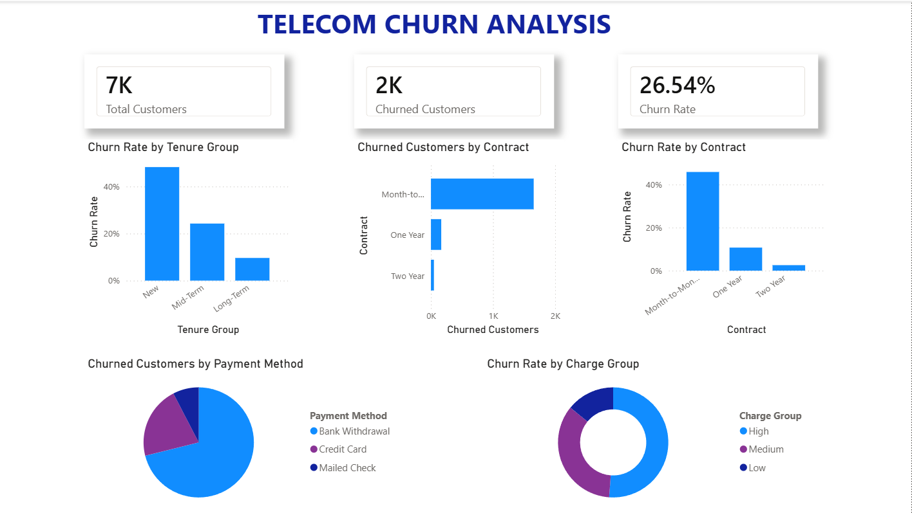

# Telco Customer Churn Prediction Analytics

## Project Overview

This project focuses on predicting customer churn for a telecommunications company using SQL, Excel, Power BI, and Microsoft Azure Machine Learning.

The objective was to identify customers at risk of leaving the company and provide actionable business insights to support customer retention strategies.

The project combines exploratory analysis, business intelligence, and predictive analytics to demonstrate an end-to-end data analytics workflow.

---

## Business Problem

Customer churn is a major challenge for telecommunications companies because acquiring new customers is generally more expensive than retaining existing ones.

The goal of this project was to:

- Analyze customer churn patterns
- Identify high-risk customer segments
- Build predictive machine learning models
- Generate business recommendations to improve retention

---

## Tools & Technologies

- Microsoft Excel
- SQL (MySQL)
- Power BI
- Microsoft Azure Machine Learning Designer
- GitHub

---

## Project Workflow

### 1. Data Cleaning & Preparation

- Removed data leakage columns
- Created churn target variable
- Standardized column names
- Prepared dataset for analysis and machine learning

### 2. Excel Analysis

Performed exploratory analysis using Pivot Tables to investigate:

- Contract segments
- Payment methods
- Customer lifecycle stages
- Pricing segments
- Senior citizen status

### 3. SQL Analysis

Conducted business-focused analysis including:

- Churn rate by contract type
- Churn rate by payment method
- Churn rate by pricing segment
- Churn rate by senior citizen status
- High-risk customer segment analysis

### 4. Power BI Dashboard




Developed an interactive dashboard to visualize:

- Overall churn rate
- Contract-based churn
- Pricing-based churn
- Customer lifecycle analysis
- Key customer segments

### 5. Azure Machine Learning

Built and evaluated two classification models:

- Two-Class Logistic Regression
- Two-Class Decision Forest

Models were trained to predict whether a customer would churn.

---

## Model Performance

| Metric | Logistic Regression | Decision Forest |
|----------|----------|----------|
| Accuracy | 95.4% | 91.7% |
| Precision | 91.7% | 84.3% |
| Recall | 90.7% | 84.5% |
| F1 Score | 91.2% | 84.4% |
| AUC | 98.9% | 95.1% |

**Selected Model:** Logistic Regression

The Logistic Regression model achieved the highest overall performance and was selected as the preferred predictive model.

---

## Key Findings

- Customers on month-to-month contracts showed significantly higher churn rates.
- New customers were more likely to churn than long-term customers.
- Customers with higher monthly charges demonstrated increased churn risk.
- Payment method patterns revealed differences in customer retention.
- Logistic Regression outperformed Decision Forest across all evaluation metrics.

---

## Business Recommendations

- Develop targeted retention campaigns for high-risk customers.
- Encourage customers to move toward longer-term contracts.
- Monitor high-charge customer segments more closely.
- Improve loyalty programs and retention incentives.
- Use predictive analytics to proactively identify churn risk.

---

## Repository Structure

```text
AzureML/
Dataset/
Excel/
PowerBI/
SQL/
README.md

```

## Skills Demonstrated

- Data Cleaning
- Exploratory Data Analysis (EDA)
- SQL Analytics
- Data Visualization
- Power BI Dashboarding
- Predictive Analytics
- Machine Learning
- Azure Machine Learning
- Model Evaluation
- Business Intelligence

---

## Author

Umer Jamal

